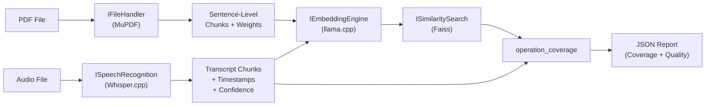
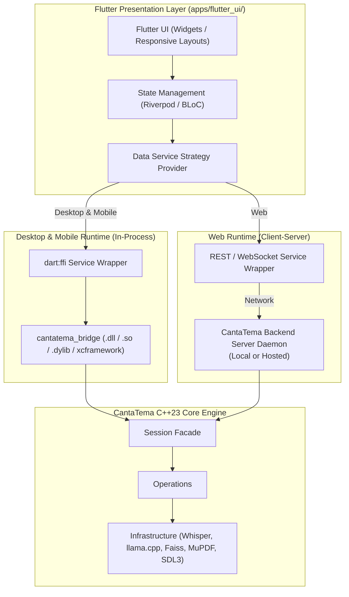

# Gemini Agent Instructions

## 🤖 Role and Persona
You are an Expert C++ Developer and Software Architect. Your task is to assist in building "CantaTema", a modern educational desktop/terminal application designed to support students preparing for competitive examinations and academic assessments. The platform allows users to practice speaking topics aloud, records their voice using Opus compression and XOR encryption, and compares their spoken explanations against reference texts (loaded from PDFs via MuPDF) using locally run Whisper.cpp models.

## 🛠 Tech Stack
- **Language:** C++23 is the main and only programming language. Configured with `-std=c++23` (GCC/Clang) or `/std:c++latest` (MSVC). For MSVC, the `/utf-8` compile option is forced to ensure proper Spanish/European character support. Unicode wide-character definitions (`UNICODE`, `_UNICODE`, `_WCHAR_T`) are defined.
- **Build System:** CMake (minimum version 3.20).
- **Target Platforms:** Windows, Linux, and macOS.
- **Localization:** Code, logs, comments, and documentation are written in English. User-facing content (categories, subjects, CLI prompts) supports Spanish.

### Dependency Version Table

| Dependency         | Version       | Purpose                                                  |
|--------------------|---------------|----------------------------------------------------------|
| SQLite             | —             | Embedded database (via custom `add_sqlite3_library`)     |
| SDL3               | 3.4.0         | Audio recording/playback, device queries, stream handling|
| Opus               | 1.5.2         | High-quality audio compression                           |
| TagLib             | 2.1.1         | Audio metadata tagging                                   |
| utf8cpp            | 4.0.9         | UTF-8 string handling                                    |
| MuPDF              | —             | PDF text extraction for reference materials              |
| Whisper.cpp        | 1.8.3         | Offline speech-to-text (CUDA -> Vulkan -> CPU on Win/Linux, Metal -> CPU on macOS) |
| libcurl            | curl-8_18_0   | HTTP-only build for Hugging Face model downloads         |
| SimpleIni          | 4.25          | Header-only INI parser for `system.ini`                  |
| fmt                | 12.1.0        | Modern string formatting                                 |
| spdlog             | 1.16.0        | Console/file logging                                     |
| cli                | 2.2.0         | Interactive CLI menus (Asio backend)                     |
| llama.cpp          | —             | Text embeddings in embedding mode (multilingual GGUF)    |
| Faiss              | —             | C++ similarity search (nearest-neighbor matching)        |
| GoogleTest/GMock   | 1.17.0        | Unit testing and mocking via CTest (`create_test_exec`)  |

## 📂 Target Project Structure
The project is modularized into discrete CMake components using a custom `create_infra_library` helper. The architecture is divided into the following layout:
- `CantaTema/apps/`: Contains executable and client targets.
  - `terminal/`: Core terminal console application handling terminal CLI loop, session, record loops, and speech commands.
  - `flutter_ui/`: Cross-platform Flutter UI application (Desktop, Mobile, Web client).
- `CantaTema/components/core/`: Shared foundation layer — basic primitives, configurations, and models.
  - `primitives/`: Domain models (`User`, `Category`, `Subject`, `PracticeEvent`), logging utilities (`utils_logger`), thread pools (`utils_thread_pool`), and paths manager (`tool_paths`).
  - `configuration/`: `ConfigurationSystem` wrapper loaded from `system.ini` which sets default limits (e.g. max sound/text file size, default allowed extensions).
  - `models/`: `ManagerModels` — unified manager for checking availability and downloading both Whisper (`ggml-*.bin`) and llama.cpp embedding (`*.gguf`) models from Hugging Face.
- `CantaTema/components/business/`: Pure business logic.
  - `operations/`: Decoupled entities operation classes (`operation_user`, `operation_category`, `operation_subject`, `operation_user_metrics`, `operation_practice_event`, `operation_coverage`) which coordinate filesystem and database handlers via injected interfaces.
  - `session/`: Facade class `Session` representing the logged-in user state and acting as the main interface to the business operation layers.
- `CantaTema/components/infrastructure/`: Subsystem integrations. Every component exposes an abstract interface.
  - `database/`: Repository classes implementing `IDatabase` using SQLite to save/retrieve user metrics, categories, subjects, and practice events.
  - `file_handler/`: Helper classes implementing `IFileHandler` for standard filesystem interactions, extension type parsing, sound metadata checking, and PDF/Text reading.
  - `sound_system/`: SDL3 audio playback and recording implementing `ISoundSystem`, wrapped with Opus codec and custom XOR-encryption logic.
  - `speech_recognition/`: Transcription implementing `ISpeechRecognition` to integrate local Whisper-based decoding.
  - `embeddings/`: Text embedding engine implementing `IEmbeddingEngine`, wrapping llama.cpp in embedding mode for vectorizing PDF and transcript chunks.
  - `similarity/`: Similarity search implementing `ISimilaritySearch`, wrapping Faiss C++ API for nearest-neighbor matching between embedding vectors.
- `CantaTema/components/c_api/`: C ABI export layer exposing `cantatema_c_api.h` and shared dynamic library (`cantatema_bridge`) for foreign language and FFI bindings (Flutter/Dart).
- `docs/`: Diagram drafts, notes, and schemas.
- `cmake/`: Installation templates and FetchContent wrappers (e.g., `add_sqlite3_library.cmake`, `library_install_test.cmake`).
- `CantaTema/example_data/`: Sample reference PDFs and recorded audio files (`.opus`) used for manual testing and development.

## 🏗 Architectural Guidelines

### Layered Architecture (Strictly Enforced)

The project follows a strict layered dependency model. Each layer may only depend on the layers **below** it, never on layers above. The layers, from bottom to top, are:

```
┌────────────────────────────────────────────────────────┐
│  Presentation Layer: Terminal CLI  |  Flutter App (UI) │  ← Top layer (apps/)
├────────────────────────────────────────────────────────┤
│           Bridge Layer: C ABI (cantatema_c_api.h)      │  ← C-linkage export boundary
├────────────────────────────────────────────────────────┤
│                  Session                               │  ← Facade for business logic
├────────────────────────────────────────────────────────┤
│                Operations                              │  ← Business rules & coordination
├────────────────────────────────────────────────────────┤
│              Infrastructure                            │  ← Database, Sound, Files, Speech,
│                                                        │    Embeddings, Similarity
├────────────────────────────────────────────────────────┤
│          Core (shared foundation)                      │  ← Primitives, Configuration, Models
└────────────────────────────────────────────────────────┘
```

#### Dependency Rules

| Source Layer          | May Depend On                                    | Must NOT Depend On              |
|-----------------------|--------------------------------------------------|---------------------------------|
| **Core**              | Standard library, external libs only             | Any higher layer                |
| **Infrastructure**    | Core, external libs                              | Operations, Session, CLI, Bridge|
| **Operations**        | Core, Infrastructure **interfaces only**         | Session, CLI, concrete infra    |
| **Session**           | Core, Operations                                 | Infrastructure directly, CLI    |
| **C ABI Bridge**      | Core, Session                                    | Operations, Infrastructure      |
| **CLI (normal)**      | Core, Session                                    | Operations, Infrastructure      |
| **Flutter UI (Dart)** | C ABI Bridge (`dart:ffi`) / Web API Service      | Internal C++ headers/classes    |
| **CLI (test/debug)**  | Core, Session, Operations, Infrastructure        | — (relaxed for manual testing)  |

> **CLI Flexibility Exception:** The CLI terminal app (`apps/terminal/`) is also used for manual testing and debug operations. Test/debug-only commands (e.g., `test_start`, `db_purge`) are permitted to access lower layers (operations, infrastructure) directly. Normal user-facing commands must go through Session.

> **Core Visibility:** `core/primitives` and `core/configuration` are shared across all layers. `core/models` (e.g., `ManagerModels`) should only be used by infrastructure or operations, not directly by CLI.

> **Test Code Exception:** Unit tests and test mocks are exempt from these layering rules. Tests may directly instantiate any class and inject mock dependencies as needed.

> **Session Invariant (Zero Direct Database Access):**
> `Session` is a pure business facade and MUST NOT have direct access to the database or concrete infrastructure repositories (`IDatabase`, `DB_Main`, `DB_Coverage`, etc.). All data persistence and querying operations must be routed exclusively through business operations (`IOperationUser`, `IOperationCategory`, `IOperationSubject`, `IOperationPracticeEvent`, `IOperationCoverage`, `IOperationAnalysisScheduler`).
> Furthermore, `purge_database` is strictly prohibited on `Session`; database purging is an infrastructure and test harness concern (managed directly via `IDatabase` / `DB_Main` in unit tests or CLI debug commands like `db_purge`), not a capability of the Session facade.

> **Database Access Limitation (Operations Exclusivity):**
> Only implementations located inside the `operations/` folder (`CantaTema/components/business/operations/`) are permitted to have access to the database (whether via `IDatabase` interfaces or concrete database repositories). No higher layers, presentation bridges, or other business facades—including `Session` and `cantatema_bridge`—may directly interact with or access the database.
> **Exclusion:** The Terminal application (`apps/terminal/`) is excluded from this limitation to permit low-level testing, maintenance, and debug commands (e.g., `db_purge`, manual inspection). Unit tests and test mocks are also exempt.

### Interface-Driven Design (Constructor Injection)

All infrastructure components must expose abstract interfaces. Upper layers (operations, session) depend exclusively on these interfaces, never on concrete implementations.

- **`IDatabase`** — Abstract interface for database repository operations.
- **`IFileHandler`** — Abstract interface for filesystem interactions and PDF/text extraction.
- **`ISoundSystem`** — Abstract interface for audio capture and playback.
- **`ISpeechRecognition`** — Abstract interface for speech-to-text transcription.
- **`IEmbeddingEngine`** — Abstract interface for generating text embeddings from chunks.
- **`ISimilaritySearch`** — Abstract interface for nearest-neighbor vector search.

**Dependency Injection Pattern:** Constructor injection is the standard. Operations and session classes receive `std::unique_ptr<IInterface>` or `std::shared_ptr<IInterface>` via their constructors. This enables:
- Clean mock injection in unit tests via GMock.
- Explicit, traceable dependency graphs with no hidden global state.
- Easy substitution of implementations (e.g., swapping SQLite for an in-memory store in tests).

```cpp
// Example: constructor injection in an operation class
class OperationUser {
public:
    explicit OperationUser(std::shared_ptr<IDatabase> db, std::shared_ptr<IFileHandler> fh);
    // ...
private:
    std::shared_ptr<IDatabase> m_database;
    std::shared_ptr<IFileHandler> m_file_handler;
};
```

### Other Architectural Principles

- **Modular Component Isolation:** Every component must be built as a distinct target (e.g., `CORE::PRIMITIVES`, `INFRASTRUCTURE::DATABASE`) by invoking the custom `create_infra_library` macro in its `CMakeLists.txt`.
- **Facade Pattern:** The `Session` class acts as the single facade to hold session context (the logged-in user) and route calls to specific business operations.
- **Filesystem Base Paths:** The system calculates storage paths via `ToolPath::get_base_path()`. In debug/non-release modes, this points to the current directory (`std::filesystem::current_path()`). In release mode (`NDEBUG` defined), it resolves to the OS-specific application directory using `SDL_GetPrefPath`. Always resolve resource and database paths through `ToolPath` functions rather than hardcoded string parameters.

## 🔊 Audio Processing & Cryptography (sound_system/)
- **Audio Format & Container:** Captured audio is encoded to Opus and structured within an Ogg stream container.
- **XOR Encryption Overlay:** For security and privacy, audio files are saved with a custom byte-level XOR masking scheme. 
- **Encryption Implementation:** Any disk writing or reading in `SoundSystem` must pass through the `xor_process` method using `secure_fwrite` and `secure_fread`. Do not call standard `std::fwrite` or `std::fread` directly when writing or reading Opus files to disk, as they will bypass encryption/decryption, causing corruption.
- **Audio Timestamps:** Monitor recording and playback progress in milliseconds using `get_recording_timestamp()` and `get_playing_timestamp()` respectively.
- **Opus-to-WAV Conversion & Temporary File Cleanup:** Opus audio files must be converted into WAV format prior to speech recognition processing. Any temporary files created during audio conversion or processing MUST be automatically removed using RAII cleanup guards if something goes wrong or upon completion to prevent leaving transient temp files on disk.

## 🤖 Speech Recognition, Model Management & Coverage Analysis

### Model Management (core/models/)
- **Unified Model Manager:** `ManagerModels` is a single class that manages both Whisper (`ggml-*.bin`) and llama.cpp embedding (`*.gguf`) model files. It replaces the previous `ManagerWhisper` to avoid duplication.
- **Model Storage:** Models are stored under `ToolPath::get_path_for_models_whisper()` (Whisper) and `ToolPath::get_path_for_models_llama()` (llama.cpp embeddings).
- **Hugging Face Downloader:** `ManagerModels` retrieves available model manifests and downloads binaries directly from Hugging Face.
- **Non-blocking Downloads:** Network downloads use libcurl callback streams. Callers can supply a `DownloadProgressCallback` to receive updates (`total_bytes`, `downloaded_bytes`, `file_name`) to display progressive loading indicators.

### Speech Recognition (infrastructure/speech_recognition/)
- **Speech Recognition Interface:** The `ISpeechRecognition` interface handles the transcription tasks. Implementing classes must accept an audio path, manage task states (`IDLE`, `PROCESSING`, `COMPLETED`, `ERROR`), and save the resulting text.
- **Word-level Timestamps:** Transcription must enable word-level timestamp output (`--output-words` / `-wt` threshold) to support voice quality metrics.
- **Confidence Data:** Enable confidence/log-probability output (`--print-confidence`, `-lpt` logprob threshold) for per-segment/per-token probability data used in clarity scoring.

### Audio-to-PDF Coverage & Quality Analyzer

This is the **core feature** of CantaTema. The system transcribes a user's spoken practice, extracts reference text from a PDF, and generates a coverage report identifying which parts of the reference material were not mentioned, weighted by importance, alongside voice speed and clarity scores.

**Constraint:** 100% local execution — no external API calls or cloud dependencies.

#### Pipeline Data Flow



#### PDF Ingestion (infrastructure/file_handler/)
- Extract raw text from PDF using MuPDF's C API (`fz_new_stext_page`).
- Preserve paragraph/section boundaries using MuPDF's block/line structure (`fz_stext_block`) rather than a single text blob.
- Segment extracted text into **sentence-level chunks** for fine-grained coverage detection.
- **Importance Weighting:** Assign an importance weight per chunk based on MuPDF text formatting attributes. Chunks containing **bold**, **italic**, **underline**, or **background-colored** text receive higher importance weights. Specific weight multipliers are to be defined during implementation and made configurable.

#### Text Embeddings (infrastructure/embeddings/)
- Generate vector embeddings for both PDF chunks and transcript chunks using llama.cpp in embedding mode.
- **Model:** `multilingual-e5-large` in GGUF format — purpose-built for multilingual semantic similarity with strong Spanish support.
- Expose the `IEmbeddingEngine` interface to allow mock injection and future model swaps.
- **GPU offload:** Optional and best-effort. CPU-first by default; GPU acceleration (`-ngl` flag) is a configurable enhancement via `system.ini`.

#### Similarity Search (infrastructure/similarity/)
- Build a similarity index using Faiss C++ API (`IndexFlatIP` or `IndexHNSWFlat`).
- For each PDF chunk, retrieve the nearest transcript chunk and its similarity score.
- **Similarity threshold:** Configurable via `system.ini` with a sensible default. Classifies each PDF chunk as "mentioned" or "not mentioned".
- Compute a **weighted missed importance score** per unmatched chunk: `importance_weight × (1 − similarity_score)`.
- Expose the `ISimilaritySearch` interface for testability.

#### Voice Quality Scoring
- **Speech rate:** Compute words/tokens per second from consecutive whisper.cpp segment timestamps.
- **Clarity score:** Compute average token log-probability / confidence per segment from whisper.cpp output.
- **Pacing/pause variance:** Compute from gaps between segment boundaries.
- **Normalization:** All scores normalized to a 0–100 scale.

#### Coverage Report Generation (operation_coverage)
- `operation_coverage` orchestrates the full pipeline: PDF ingestion → transcription → embedding → similarity matching → scoring → report.
- **Output format:** JSON — structured, machine-readable, suitable for post-processing or future UI visualization.
- Report contents:
  - PDF sections not covered, sorted by weighted importance score.
  - Per-segment and aggregate voice speed and clarity scores.
  - Overall coverage percentage.

## 📏 Coding Standards & Quality

### C++ Language Requirements
- **C++23 is the main and only language.** All production code, tests, and utilities are written in C++.
- **Standards Compliance:** All code must conform strictly to standard C++23. Do not use compiler-specific language extensions unless wrapped in preprocessor tags.
- **Resource Management:** Prefer smart pointers (`std::unique_ptr` and `std::shared_ptr`) to enforce RAII. Avoid manual calls to `delete` or `free` unless dealing directly with C library pointers (like SDL3 context structures or curl pointers) that require specialized cleaners.

### Error Handling Strategy
- **Mixed approach:** Use C++ exceptions for truly exceptional / unrecoverable situations (e.g., failed database initialization, corrupt audio file). Use `std::expected` or `std::optional` return types for expected failure paths (e.g., user not found, invalid input, file not present).
- **Domain exceptions:** When exceptions are used, prefer domain-specific exception types (e.g., `DatabaseException`, `AudioException`) over generic `std::runtime_error`.

### Documentation & Logging
- **Doxygen Documentation:** The mandatory documentation style is **Doxygen**. All files, classes, structs, enums, public/private methods, and helper functions must be documented with detailed Doxygen-style comments (`/** ... */` or `///`) including `@file`, `@brief`, `@param`, `@return`, `@throws`, and structural block tags.
- **Logger Usage:** System logs must write to the unified `logger` instance (configured via `utils_logger.hpp`), categorized by log severity levels (`info`, `debug`, `warn`, `error`).

### Testing & Code Coverage
- **Testing Requirements:** Every newly added or modified logic must have comprehensive unit tests written with the GoogleTest framework, placed under the appropriate component's `test` folder. Mocks (under `mocks` folder) should be used to isolate classes under test.
- **Speech Recognition Testing Strategy (GoogleTest & GMock):**
  - **Interface-Level Mocking:** Use `MockSpeechRecognition` deriving from `ISpeechRecognition` to test higher-level components (`OperationCoverage`, `Session`) without executing real model inference.
  - **Engine Decoupling:** Decouple low-level `whisper.cpp` C library function calls behind an internal engine wrapper interface (e.g., `IWhisperEngineWrapper`) so `WhisperSpeechRecognition` can be unit-tested with a `MockWhisperEngineWrapper` without loading model binary files or triggering full hardware decoding.
  - **Test Scenarios:** Verify context initialization and GPU-to-CPU fallback, audio buffer normalization and sample rate checks, segment/progress callback triggers and logging, error path handling on whisper execution failures, and proper RAII resource cleanup of whisper contexts.
- **Code Coverage:** Code coverage is enabled using GCC/Clang `--coverage` options (via MinGW on Windows).
  - **Enforcement:** Production source files (`.h`, `.hpp`, `.c`, `.cpp`) must maintain at least **90% coverage per file**.
  - **Excluded from the 90% requirement:**
    - Test files and test mocks.
    - External/third-party dependencies.
    - CLI terminal application code (`apps/terminal/`).
    - Entry point files (e.g., `main_terminal.cpp`).
  - **Execution Commands:**
    ```powershell
    cmake -B build -DENABLE_COVERAGE=ON
    cmake --build build --config Debug
    ctest --test-dir build -C Debug -T coverage
    ```

### 🧹 Workspace Hygiene & Post-Task Cleanup (Mandatory)
- **Zero Temporary File Leftovers:** After completing any task, the agent must verify that no temporal or generated files (such as `.gcov`, temporary `.wav`/`.tmp` files, scratch logs, or test artifacts) are left behind in the workspace root or source trees.
- **Pre-Conclusion Verification:** Always check `git status` or scan for untracked transient files to ensure the working tree remains completely clean before completing an interaction.

## ⚙️ Configuration Reference (`system.ini`)

All runtime-configurable parameters are managed via `system.ini`, loaded by `ConfigurationSystem`. Keys are organized by INI section. New keys for the coverage analyzer are marked as *planned*.

| Section          | Key                        | Default     | Description                                                    |
|------------------|----------------------------|-------------|----------------------------------------------------------------|
| `TEXT_FILES`     | `extensions_allowed`       | `*.txt\n*.pdf` | Allowed text file extensions (newline-separated)            |
| `SOUND_FILES`    | `extensions_allowed`       | `*.opus`    | Allowed sound file extensions                                  |
| `USER_LIMITS`    | `max_text_file_size_mb`    | `25`        | Maximum text file size per user (MB)                           |
| `USER_LIMITS`    | `max_sound_file_size_mb`   | `25`        | Maximum sound file size per user (MB)                          |
| `USER_LIMITS`    | `usage_limit_mb`           | `512`       | Total storage usage limit per user (MB)                        |
| `COVERAGE`       | `similarity_threshold`     | TBD         | *Planned.* Cosine similarity threshold for "mentioned" classification |
| `COVERAGE`       | `importance_weight_bold`   | TBD         | *Planned.* Weight multiplier for bold-formatted text chunks    |
| `COVERAGE`       | `importance_weight_italic` | TBD         | *Planned.* Weight multiplier for italic-formatted text chunks  |
| `COVERAGE`       | `importance_weight_underline` | TBD      | *Planned.* Weight multiplier for underlined text chunks        |
| `COVERAGE`       | `importance_weight_bg_color` | TBD       | *Planned.* Weight multiplier for background-colored text chunks|
| `EMBEDDINGS`     | `gpu_offload_layers`       | `0`         | *Planned.* Number of layers to offload to GPU (`-ngl` flag). `0` = CPU only |

## 💻 Terminal CLI Interaction & Commands
To run the interactive shell of the CantaTema project:
1. Ensure the project is compiled: `cmake --build build --config Debug`
2. Run the executable: `.\build\bin\Terminal_CLI\Terminal_CLI.exe`
3. Execute CLI commands directly. Commands are organized into menus:
   - **Authentication / Initialization Flow:**
     - `test_start`: Purge database and populate it with test categories, subjects, and users. *(test/debug — accesses lower layers directly)*
     - `db_purge`: Completely clean database records. *(test/debug — accesses lower layers directly)*
     - `user user_add <username> <password>`: Create a new user account.
     - `user_identify <username> <password>`: Authenticate as a user and initialize the active user session.
     - `user user_get`: Display details of the active user.
     - `metrics`: Retrieve metrics of the authenticated user.
   - **Category Management (`category` menu):**
     - `category category_add <name>`: Create a new study category.
     - `category category_get`: View all categories registered under the active user.
   - **Subject Management (`subject` menu):**
     - `subject subject_add <category_id> <name>`: Register a new study subject under a category.
     - `subject subject_get_by_user`: Get all subjects of the current user.
   - **Practice & Recording Loop (`practice` menu):**
     - `practice add_recorded <subject_id> <name>`: Register a practice session and trigger SDL3 audio capture.
     - `practice play <practice_id>`: Decrypt (XOR) and play back the recorded practice event using SDL3 playback streams.
   - **Whisper Models (`whisper` menu):**
     - `whisper models`: Check locally available and download-ready GGML models.
     - `whisper download <model_name>`: Fetch the specified GGML model weight from Hugging Face.

## 🛑 Agent Operational Rules (CRITICAL)
1. **No Hallucinations:** Do not fabricate libraries, guess headers, or invent dummy methods to bypass compilation failures. If an external API is unknown, check the official documentation or look at similar implementations in the codebase.
2. **Ask for Clarification:** If a design decision or project requirement is ambiguous, stop and ask the user for clarification.
3. **Minimal Modifications:** Change only what is strictly necessary to solve a bug or implement a feature. Avoid large formatting rewrites that make code reviews difficult.
4. **Respect Layered Architecture:** Never introduce a dependency that violates the layered architecture rules defined in this document. If a change requires cross-layer access, refactor through the proper interface chain.
5. **Verifying Code Correctness:** Every modification must compile and pass all tests. Run the test suite by executing:
   ```powershell
   cmake -B build
   cmake --build build --config Debug
   ctest --test-dir build -C Debug
   ```
6. **Temporary Scripts:** Create any test scripts or debug binaries inside a `scratch/` folder at the root directory of the workspace.
7. **No Direct Modifications to `build/` Directory:** Never edit or modify files inside the `build/` directory or its subdirectories (e.g., `build/_deps/`). The `build/` directory is transient and completely wiped during clean builds or environment resets. Any build configuration patches, string replacements, or dependency modifications MUST be written cleanly into tracked repository files (such as root `CMakeLists.txt`, `cmake/*.cmake`, or component source code) so they automatically execute during CMake configuration.
8. **Architecture & Schema Synchronization:** Whenever CMake target definitions, component libraries, abstract interfaces, or core features are added, removed, or modified, you MUST update [docs/dev.md](docs/dev.md) and its Mermaid architecture schema to accurately reflect the exact state of the project.

## 📝 Documentation Guidelines
- **Interface & Schema Changes:** If database schemas, configuration files, or core component interfaces change, update the documentation in the `docs` folder or add relevant annotations.
- **Developer Guide:** Refer to [docs/dev.md](docs/dev.md) for detailed configuration, compilation, unit testing, coverage reporting, and CLI usage instructions.
- **Roadmap & Subphases:** Refer to [docs/phases.md](docs/phases.md) for the complete implementation schedule, architectural layout, QA/testing thresholds, and design FAQs.
- **Future Comparison Engine Architecture:** Refer to [docs/future_plans.md](docs/future_plans.md) for multi-language profile abstraction (`ILanguageProfile`), orthogonal subject domain profiles (`IDomainProfile` for Law, Economics, Science, History, General), configurable INI token weighting, weighted recall metrics, and lemmatization roadmap.
- **Flutter Middleware C ABI Reference & Integration Specification:** A mandatory dedicated document [docs/c_api_reference.md](docs/c_api_reference.md) must be maintained to document every exported C ABI function, parameter types, return values, memory allocation/freeing rules (e.g. `canta_free_string`), status error codes, and JSON payload contracts. This document is explicitly used by the frontend agent developing the Flutter application.

## 📱 Flutter Cross-Platform Architecture & Integration (Desktop, Mobile, Web)

The application frontends (Desktop, Mobile, and Web) use Flutter (Dart) integrated with the C++23 core through an **Interface Bridge Architecture**.

### 1. Architectural Strategy & Rationale
- **Single Source of Truth:** 100% of business logic, audio encryption (XOR/Opus), PDF chunk extraction (MuPDF), speech recognition (Whisper.cpp), embeddings (llama.cpp), and vector search (Faiss) reside exclusively in C++. Flutter is strictly a presentation and state management layer.
- **Interface Bridge (`dart:ffi` + C ABI):** Flutter interacts with the C++ `Session` facade through an `extern "C"` wrapper (`cantatema_c_api.h` in `components/c_api/`). This avoids C++ ABI name mangling and template incompatibility while allowing automatic Dart binding generation via `ffigen`.
- **Zero-Latency & Non-Blocking Concurrency:** Native worker threads in C++ handle long-running AI pipelines without blocking Flutter's 60/120 FPS UI thread. Asynchronous events and progress callbacks are dispatched back to Dart isolates using `Dart_PostCObject` / `NativePort`.

### 2. Multiplatform Execution Models



- **🖥️ Desktop (Windows, macOS, Linux):**
  - **Bridge:** In-process direct `dart:ffi` linking to dynamic shared library (`cantatema_bridge.dll` / `.dylib` / `.so`).
  - **Acceleration:** Direct hardware acceleration with GPU backends (Vulkan / CUDA / Metal) for Whisper transcription and llama.cpp embeddings.
- **📱 Mobile (Android & iOS):**
  - **Bridge:** In-process direct `dart:ffi` linked to cross-compiled shared libraries (Android NDK `jniLibs` for `arm64-v8a` / `x86_64`, iOS `.xcframework` via Xcode/CocoaPods).
  - **Model Management:** Quantized / compact model profiles (`whisper-tiny`/`base`, `q4_k_m`) managed on-demand over Wi-Fi via `ManagerModels`. Permissions and sandbox paths resolved via Flutter platform plugins and injected into `ToolPath`.
- **🌐 Web (Flutter Web):**
  - **Architecture:** Client-Server model. Flutter Web compiles to WebAssembly/JavaScript SPA and connects via REST / WebSockets to a lightweight CantaTema backend daemon (hosted locally or remotely).
  - **Reusability:** The Flutter UI and state providers remain identical; only the communication adapter switches between `FFIService` (native) and `HttpWebSocketService` (web).

### 3. Flutter Directory Layout (`CantaTema/apps/flutter_ui/`)
```
apps/flutter_ui/
├── lib/
│   ├── bridge/           # Generated ffigen bindings & C ABI wrapper classes
│   ├── services/         # Data services (FFIService for Native, HttpService for Web)
│   ├── state/            # State management (Riverpod / BLoC providers)
│   ├── views/            # Responsive UI screens (Desktop, Tablet, Mobile)
│   └── main.dart
├── windows/              # Windows Runner (links cantatema_bridge.dll)
├── macos/                # macOS Runner (links cantatema_bridge.dylib)
├── linux/                # Linux Runner (links libcantatema_bridge.so)
├── android/              # Android Runner (NDK jniLibs)
├── ios/                  # iOS Runner (.xcframework)
└── web/                  # Web Runner (SPA connecting to CantaTema server daemon)
```

### 4. C ABI Middleware Exported Interface & Documentation Requirement
The C ABI bridge layer (`CantaTema/components/c_api/` producing the shared library `cantatema_bridge`) is the official middleware connecting the C++ native core engine with the Flutter frontend application.
- **Mandatory Documentation:** Every exported C ABI function must be thoroughly specified in [docs/c_api_reference.md](docs/c_api_reference.md). The documentation must detail:
  1. Function name, signature, and calling convention (`extern "C"`, exported with `__declspec(dllexport)` on Windows or `__attribute__((visibility("default")))` on Unix/macOS).
  2. Concrete description of the operation performed.
  3. Parameters (name, type, nullability, valid ranges, JSON structure if string).
  4. Return value (type, status codes: `0` for success, negative for error codes such as `CANTA_ERR_INVALID_ARG`, `CANTA_ERR_NOT_FOUND`, `CANTA_ERR_NOT_INITIALIZED`, `CANTA_ERR_AUDIO_BUSY`, etc., or JSON payload).
  5. Memory management invariant: all heap-allocated string pointers returned by the engine across the ABI boundary must be deallocated by the caller via `canta_free_string(const char* ptr)`.
  6. Exact JSON input/output schemas with examples (for categories, topics, study sessions, analysis reports, schedule tasks, calendar events, AI models, and user profiles).
- **Target Audience:** This document serves as the implementation specification and communication contract for frontend development agents building the Flutter UI and Dart FFI bridge service layer.


