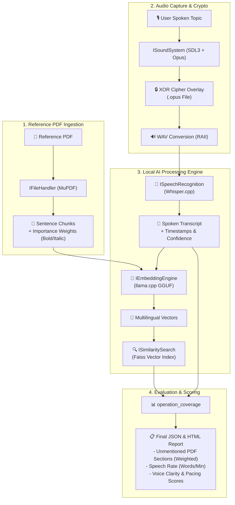

# 🎙️ CantaTema

CantaTema is an educational application designed to support students preparing for competitive examinations and academic assessments that require the oral mastery of specific topics. The platform combines structured content organization with voice analysis to provide objective, actionable feedback on oral performance.

> [!IMPORTANT]
> **100% Local & Offline AI Execution:** All audio transcription, text vector embeddings, and similarity analysis run strictly on your local hardware using standard C++23. No external API calls or cloud dependencies are used.

---

## 📌 Introduction

Preparing for exams such as public service examinations, law-related assessments, or other high-demand academic evaluations often requires not only memorization, but also the ability to clearly and accurately explain a topic aloud. Traditional study methods rarely provide objective feedback on oral delivery, structure, or fidelity to the source material.

CantaTema addresses this gap by allowing users to practice speaking a topic out loud while comparing their recorded explanation against the original reference text. The application evaluates performance and highlights areas for improvement, transforming passive study into an active, measurable training process.

---

## 🎯 Purpose

The main purpose of CantaTema is to help users:

- 🗣️ **Master complex topics** through structured oral practice  
- 🎯 **Improve accuracy, clarity, and completeness** when explaining a subject  
- 📊 **Receive objective scoring and feedback** based on comparison with official or reference materials  
- 🏆 **Prepare effectively** for oral exams, written exams with oral study techniques, and competitive examinations  

CantaTema is especially focused on candidates preparing for public service examinations (*oposiciones*), professional certifications, and academic tests where precision and completeness are critical.

---

## ⚡ Key Features

- 📚 **Reference Management:** Organization of study topics and reference materials (PDF / Text).
- 🎙️ **Voice Capture:** High-quality voice recording with Opus compression and XOR byte-encryption.
- 🤖 **Offline Speech-to-Text:** Local transcription via Whisper.cpp with word-level timestamps and confidence metrics.
- 🧠 **Semantic Vector Comparison:** Sentence-level text chunking and llama.cpp embedding vector similarity search using Faiss.
- 📈 **Comprehensive Quality Scoring:** Objective metrics based on coverage percentage, speech rate (WPM), clarity score, and weighted missed content identification.

---

## 🧠 Local AI & Voice Analysis Pipeline

The diagram below illustrates how CantaTema ingests reference material and user audio to evaluate oral coverage and voice quality completely offline:

---

## 👥 Target Audience

- ⚖️ **Public Examination Candidates (*Opositores*):** Candidates preparing for state, legal, or administrative oral boards.
- 🎓 **University & Postgraduate Students:** Learners mastering complex theoretical subjects.
- 📜 **Legal & Professional Certification Candidates:** Professionals training for rigorous oral defenses.
- 🗣️ **Active Learners:** Anyone needing to structure and reproduce complex concepts aloud with high fidelity.

---

## 💡 Use Cases

- ⏱️ **Practicing Oral Exposition:** Simulating real exam conditions by reciting a full topic against a timer.
- 🧠 **Structuring Theory:** Memorizing and breaking down long theoretical chapters into sentence-level key points.
- 🔍 **Identifying Weak Points:** Locating specific missed paragraphs and key terms before taking an exam.
- 🎤 **Voice & Pacing Training:** Monitoring words-per-minute speed and segment clarity to avoid monotone or rushed delivery.

---

## 🔒 Security & Privacy

> [!TIP]
> **Audio Privacy Overlay:** Recorded audio sessions are encrypted at rest using a byte-level XOR masking scheme to prevent unauthorized playback outside CantaTema.

---

## 🚧 Project Status

This project is under active development. Features, structure, and documentation evolve regularly as new capabilities are added. Refer to [docs/dev.md](docs/dev.md) for build, testing, and contribution instructions.

## 🤝 Third-Party Attributions

CantaTema integrates several open-source libraries and engine backends (including Whisper.cpp, llama.cpp, Faiss, SDL3, Opus, MuPDF, SQLite, and spdlog). We gratefully acknowledge all open-source contributors. For a complete list of dependencies, licenses, and copyright notices, see [ATTRIBUTIONS.md](ATTRIBUTIONS.md).

---

## 📜 License

This project is licensed under the **GNU General Public License v3.0** (GPL-3.0). See the [LICENSE](LICENSE) file for details.

---

*CantaTema – Train your voice. Master your topics.*
