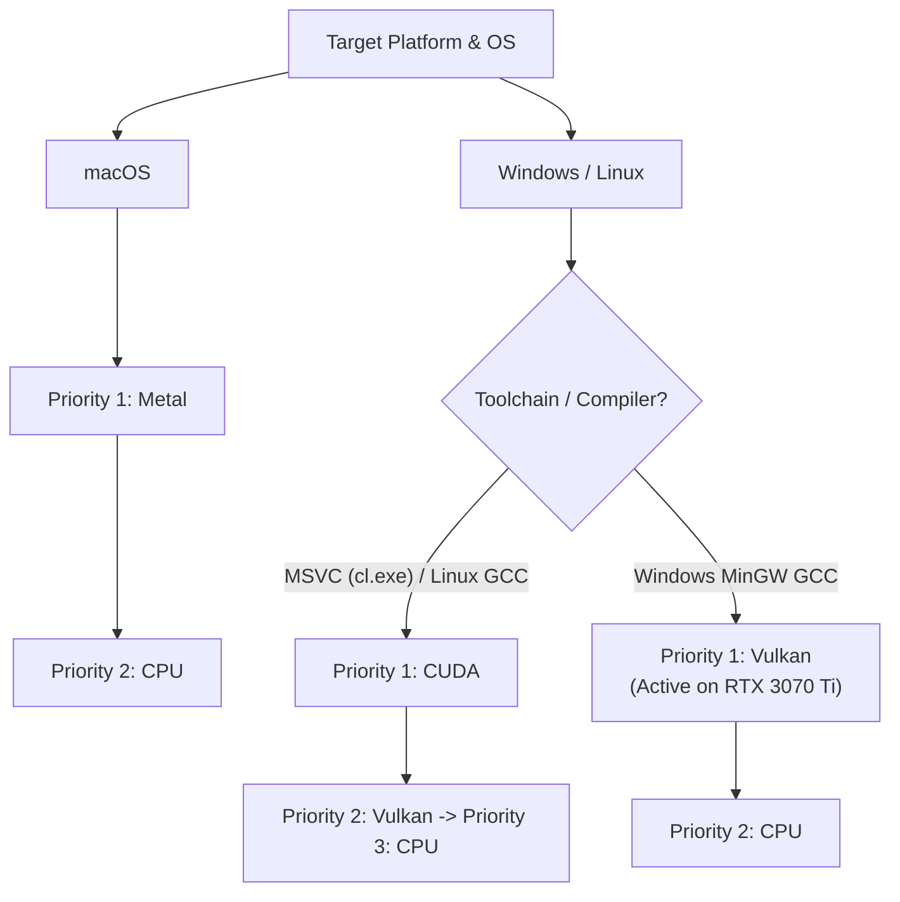

# CantaTema - Developer Guide

Welcome to the development environment for **CantaTema**. This document guides you through configuring, compiling, testing, analyzing code coverage, and executing the interactive CLI application.

---

## 📋 Prerequisites

Before starting, ensure you have the following installed on your system:
- **Compiler:** GCC 13+, Clang 16+, or MSVC 2022 (Must support standard **C++23**).
- **Build Tool:** CMake (version 3.20 or higher).
- **Libraries & SDKs:**
  - **Windows (MinGW/MSYS2):** Recommended toolchain is `ucrt64` which provides `gcc`/`g++`, `cmake`, `pkg-config`, and required audio/networking backends.
  - **Vulkan SDK:** (Optional, but recommended on Windows/Linux for Whisper.cpp hardware acceleration).

---

## ⚙️ 1. Project Configuration

Configure the build system using CMake. Dependencies are fetched and compiled automatically via CMake's `FetchContent` mechanism.

### Standard Configuration
By default, this configures the project to build static binaries with testing enabled:
```powershell
cmake -B build
```

### Configuration with Coverage Enabled
To instrument binaries for code coverage analysis:
```powershell
cmake -B build -DENABLE_COVERAGE=ON
```

---

## 🛠️ 2. Compilation

Compile all targets, including the primary application and unit tests.

### Compile Debug Build (Default)
```powershell
cmake --build build --config Debug
```

### Compile Release Build (Optimized)
```powershell
cmake --build build --config Release
```

---

## 🧪 3. Running Unit Tests

CantaTema uses **GoogleTest** (gtest/gmock) for testing. Tests are registered under **CTest**.

### Execute All Tests
```powershell
ctest --test-dir build -C Debug
```

### Run Tests with Detailed Output
If a test fails and you need to inspect logs:
```powershell
ctest --test-dir build -C Debug -V
```

---

## 📊 4. Code Coverage Analysis

Code coverage requires compiling with coverage flags enabled (`-DENABLE_COVERAGE=ON`) and executing tests with CTest's coverage runner.

### Code Coverage Enforcement
- **Standard:** All production source files (`.h`, `.hpp`, `.c`, and `.cpp` containing logic, excluding tests, mocks, or external packages under `build/_deps`) must maintain at least **90% coverage**.

### Generate Coverage Reports
Run the following sequential commands:
1. Re-configure the project with coverage active:
   ```powershell
   cmake -B build -DENABLE_COVERAGE=ON
   ```
2. Clean previous build objects to force complete coverage instrumentation:
   ```powershell
   cmake --build build --target clean
   ```
3. Compile the targets:
   ```powershell
   cmake --build build --config Debug
   ```
4. Run tests and process coverage data using `gcov` (Note: Run this command from the **workspace root**):
   ```powershell
   ctest --test-dir build -C Debug -T coverage
   ```

*The aggregated coverage files will be located in the `build/Testing/` directory.*

---

## 📚 5. Generating Doxygen Documentation

Doxygen documentation is configured as a dedicated, opt-in target (`doxygen_docs`) and is **not** compiled during normal build commands.

### Local Execution (On Demand)
Run the following command from the workspace root to generate HTML documentation:
```powershell
cmake --build build --target doxygen_docs
```

- **Output Path:** Generated HTML files are placed in `build/docs/doxygen/html/index.html`.
- **System Requirements / Fallback:** If Doxygen is installed on the host system, standard CMake `find_package(Doxygen)` is used. If not found locally, CMake automatically downloads the prebuilt Doxygen binary release via `FetchContent` to provide the documentation target.

---

### Manual CI Workflow (`.github/workflows/generate_docs.yml`)

A dedicated GitHub Actions workflow is provided for manual execution on a Linux runner (`ubuntu-latest`).

#### 1. Triggering Manually on GitHub:
1. Go to the repository's **Actions** tab on GitHub.
2. Select **Generate Documentation** from the left workflows list.
3. Click **Run workflow** -> Select branch -> Click **Run workflow**.

#### 2. Downloading Generated Files:
Once the run completes, scroll down to the **Artifacts** section of the run summary and click **`doxygen-docs`** to download the generated HTML documentation as a `.zip` archive.

#### 3. Reusing Artifacts in Downstream Workflows:
Downstream GitHub Actions workflows can download and reuse the generated documentation using `actions/download-artifact@v4`:
```yaml
- name: Download Documentation Artifact
  uses: actions/download-artifact@v4
  with:
    name: doxygen-docs
    path: build/docs/doxygen/html/
```

---

## 💻 6. Executing the Tool

To run the interactive console shell application:

```powershell
.\build\bin\Terminal_CLI\Terminal_CLI.exe
```

### Recommended First-Time Execution Flow

1. **Populate Test Data:**
   Purge the local database and populate categories, subjects, and test users:
   ```text
   cli> test_start
   ```
2. **Authenticate Session:**
   Identify/login to start your practice session (creates local workspace directories):
   ```text
   cli> user_identify iscapla iscapla
   ```
3. **Register/Check Whisper Models:**
   See available models locally and on the Hugging Face repository:
   ```text
   cli> whisper models
   ```
   Download a model (e.g. `tiny`) to begin transcribing:
   ```text
   cli> whisper download tiny
   ```
4. **Recording/Playback Practice:**
   Enter the `practice` menu to start SDL3 recording:
   ```text
   cli> practice add_recorded 1 my_session
   cli> practice play 1
   ```

---

## 🔌 6. IDE Integration (VS Code / Antigravity)

To make the graphical **"Run Test with Coverage"** button work directly within the IDE:
1. Ensure your `.vscode/settings.json` includes the path to `gcov.exe`:
   ```json
   {
       "cmake.gcovpath": "C:\\msys64\\ucrt64\\bin\\gcov.exe"
   }
   ```
2. Trigger **CMake: Clean Configure** from the VS Code command palette (`Ctrl + Shift + P`) to reload the configuration.

---

## 📊 7. Generating Visual Coverage Reports (gcovr)

To generate visual HTML report details:
1. **Install gcovr:**
   - **Via MSYS2 UCRT64 Package Manager:**
     ```bash
     pacman -S mingw-w64-ucrt-x86_64-gcovr
     ```
   - **Via Python Pip (Universal):**
     ```bash
     pip install gcovr
     ```
2. **Generate HTML Report:**
   Run this at the workspace root (use the absolute path `/ucrt64/bin/gcovr.exe` if `gcovr` is not in your environment PATH):
   ```bash
   /ucrt64/bin/gcovr.exe -r . --filter CantaTema/ --html-details -o build/coverage.html
   ```
3. Open `build/coverage.html` in your browser.

---

## ⚡ 8. GPU Acceleration Architecture & Selection Rules

CantaTema supports local AI inference acceleration (for Whisper.cpp speech-to-text and llama.cpp text embeddings) across Windows, Linux, and macOS.

### Toolchain & Backend Selection Matrix

| Operating System | Toolchain / Compiler | Primary GPU Backend | Secondary Fallback | Notes & Technical Rationale |
|------------------|----------------------|---------------------|--------------------|-----------------------------|
| **Windows**      | **MinGW GCC**        | **Vulkan**          | CPU                | `nvcc` requires MSVC `cl.exe` on Windows. Vulkan offloads tensor matrix operations directly to NVIDIA Tensor Cores (`GL_NV_cooperative_matrix2`) at native FP16 execution speeds. |
| **Windows**      | MSVC (`cl.exe`)      | CUDA                | Vulkan -> CPU      | Built natively using NVIDIA CUDA Toolkit. |
| **Linux**        | GCC / Clang          | CUDA                | Vulkan -> CPU      | `nvcc` natively supports GCC host compiler on Linux. |
| **macOS**        | Apple Clang          | Metal               | CPU                | Native Metal performance on Apple Silicon. |

### GPU Acceleration Priority Selection Schema



```text
               ┌───────────────────────────────────────────────┐
               │              Target Platform & OS             │
               └───────────────────────┬───────────────────────┘
                                       │
                      ┌────────────────┴────────────────┐
                      ▼                                 ▼
             Windows / Linux                         macOS
                      │                                 │
           ┌──────────┴──────────┐                      ├─ Priority 1: Metal
           ▼                     ▼                      └─ Priority 2: CPU
    MSVC / Linux GCC         MinGW GCC
           │                     │
   Priority 1: CUDA      Priority 1: Vulkan (Active on RTX 3070 Ti)
   Priority 2: Vulkan    Priority 2: CPU
   Priority 3: CPU
```

### Technical Rationale: Vulkan on Windows MinGW GCC

1. **Host Compiler Requirement (`nvcc` on Windows):**
   NVIDIA's `nvcc.exe` compiler on Windows strictly requires Microsoft Visual C++ (`cl.exe`) as its host compiler backend. When building under MinGW GCC (`g++.exe` / MSYS2 UCRT64), `nvcc` fails at configuration time (`nvcc fatal: Cannot find compiler 'cl.exe' in PATH`).
2. **NVIDIA Tensor Core Offloading:**
   The Vulkan backend (`ggml-vulkan`) compiles natively under MinGW GCC using `glslc` (SPIR-V shader compiler from `shaderc`) and standard Vulkan loader (`vulkan-1.dll`). On NVIDIA RTX GPUs (such as the RTX 3070 Ti / 4000 / 5000 series), Vulkan utilizes NVIDIA cooperative matrix extensions (`GL_NV_cooperative_matrix2`), offloading model tensor weights directly into VRAM and achieving GPU performance matching CUDA.

